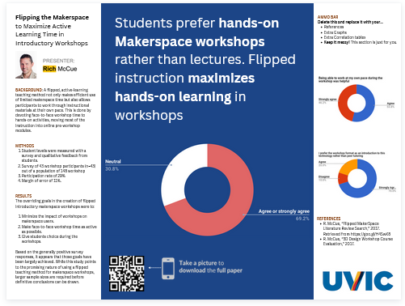

# Academic Poster Tips with Canva
 
Here are some tips for creating an academic poster using Canva. If you have any questions, please ask! 

**1. Option B: Use a Canva Template:**
   - From the Canva.com home page, click on the **Create A Design** button in the upper right corner, and then click on **Custom Size** at the bottom of the drop-down. This will open up a list of options for Width and Height. Change the smaller drop-down here from **“px”** (which is short for pixels) to **“in”** (short for inches) if you have a specific printed poster size you need. 48” by 36” is a common size for a full size, printed academic poster. Click on **Create New Design** below this once you’ve entered the dimensions you want. 
   - Type in **Research Posters** in the upper left **search templates** field and this will bring up a number of templates to get you started. 
   - Once you have picked a starting point for your poster, you can click on **Styles** in the upper left corner for even more ideas. (You will need to clear the search field because "Research Posters" will still be there and searching the Styles list. Click on the X to get rid of it and bring up the list of Styles options.) Here you can find **Color Palattes** and **Font Sets**. If you click on an individual Color Palette multiple times, this will cycle your design through various ways the same colour combo can display in the design.
  
**2. Option A: Use an UVic-themed Academic Poster template:**
   - If you want to work with a template we made, you can click here to access our template based on the #BetterPoster format (see example above), and start working on it: [UVic themed #BetterPoster template](https://www.canva.com/design/DAFYzpd1yU8/olf9xuPArpgDg7WZmWMIQA/view?utm_content=DAFYzpd1yU8&utm_campaign=designshare&utm_medium=link&utm_source=publishsharelink&mode=preview){:target="_blank"}

[NEXT STEP: Canva Take Home Sheet](canva-take-home-sheet.html){: .btn .btn-blue }
