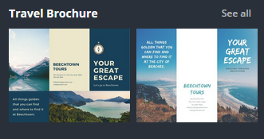
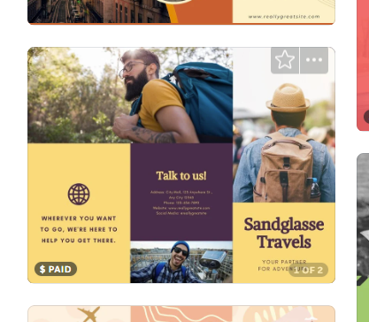
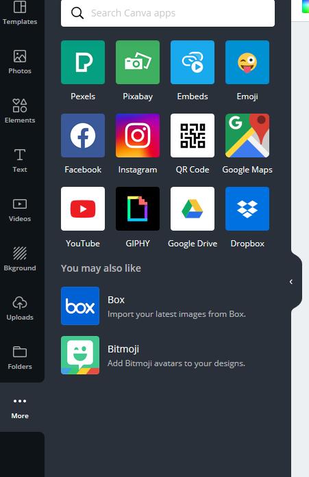
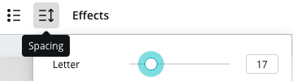
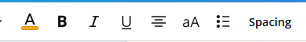

# Design a Brochure with Canva 
 
Let’s start to create a poster using a Canva template. If you have any questions, please ask, and don’t forget to have fun!

1. Create a Canva account at [canva.com](https://www.canva.com/){:target="_blank"}

2. Click in the search box in the upper centre of the screen.
  - Type **purple yellow travel brochure** in the search box and then hit the Enter key. In the left hand sidebar, go down to the **Filters** section and check the box next to **Brochure** to filter only brochure templates. Scroll down to find one that is purple and yellow (see image to the right).   Click on it to use it for this exercise. This template sometimes doesn’t come up if filters are turned on for Free, since there are premium images in this template. You may need to clear the Filter in the left hand sidebar menu by going down to the **Price** section and unchecking the box for **Free**. 
  
3. For this exercise, we are going to show you a different way to replace images. (_Note: all the images with watermarks on them indicate images that are part of the premium membership with Canva or are charged per use._) 
  - Rather than deleting the images, a quick way to replace an image in a template is to leave the demo images in place, search for a replacement image, and instead of clicking on the image you’ve chosen, drag it over and drop it on top of the demo image in the poster template (see animated GIF below for a demo). 
  - It will replace the image inside the frame and will be cropped in place. If you accidentally clicked on the image and it appears in the template on top of everything, simply delete it and try to drag it again in one motion.  
  - Once the photo is inside the shape, you can **double click** on it and the whole photo will appear, slightly greyed out and you will be able to resize and move it to fit into the shape where you want it. Once happy, click outside the template to deselect it. 
  - To find new photos, mouse over to the menu on the left side of your screen and click on **More**. This will bring up some additional image search options. Click on the **Pexels** or **Pixabay** icon to add it to your left sidebar menu. 
  - A search bar will appear in the top with “Search Pexels (or Pixabay) for free images” in grey in it. Use this search bar to search keywords and find an image you like. Clicking on the image of your choice in the search results will add it to your poster. 

4. If Canva services do not have the free photos and elements that are quite what you are looking for, you can use websites such as [Pexels](https://www.pexels.com){:target="_blank"} or [Unsplash](https://unsplash.com){:target="_blank"} or upload your own images and logos to add to your designs. 
  - Open another browser tab and go to [**Pexels**](https://www.pexels.com/){:target="_blank"} and search for more images. Download one when you find one or more that you like. 
  - Back in Canva, click on the **Uploads** button in the left sidebar menu and then click on the **Upload an image or video** button. Find the image you just downloaded and upload it to Canva. When it’s finished loading, click on the thumbnail to add it to your design. 
  - Use the handles and the Shift key (as needed) to move, resize, and/or crop the image to fit.

    <button onclick="toggle('gif1')">Show/Hide Animation</button>
    

    
    
 

5. Repeat these steps using Canva’s Photos, Pexels, Pixabay, or the Uploads option to replace all the images in the brochure with workshop-themed images.

6. Changing the colour scheme:
  - Click on one of the yellow colour blocks. Up in the left corner you will see a little yellow swatch appear. You can click on this to bring up colour options. You can choose any of the default colours, or if you know colour names or the Hex codes for specific colours, you can search for them here. For this workshop example, we used the official UVic Yellow and Hex Code: **#F5AA1C** for yellow and the Dark Blue Hex Code: **#002754** to change the purple blocks. 
  - Once you’ve added the new colours, they will show up under **Document Colours** and so you don’t have to keep searching for them.
  - Change the text colours to match by clicking on the text box you want to change, and then up in the text menu at the top of the screen, click on the **A** button with the colour bar under it, and then choose a colour swatch. (See below for example.)
   
   <button onclick="toggle('gif2')">Show/Hide Animation</button>
   

   
   
 

7. Replace the icon:
  - Next we will replace the globe icon with  another icon. First, click on the globe to select it, and then delete it.
  - In the left sidebar menu, click on **Elements** and then in the search bar, search for clipart that fits your brochure. Find one that is made of solid lines (like the globe). Click on it once to add it to the brochure. 
  - Resize it down and centre it over the text. Notice that this element has a colour swatch in the upper left corner. Click on it and change it to the Dark Blue of the brochure theme. (see below)
   
   

8. One last edit before finishing is to make a slight change to the header text: this font looks just a little too squished together. Click on “**Talk to us!**” on the first page of the brochure to select it, and then click on the **Spacing** button in the upper menu bar. Adjust the **Letter spacing** a little bit. Repeat for all the header text using the same font. You’ll want to make sure that the spacing is consistent across all the headers. 

  <button onclick="toggle('gif3')">Show/Hide Animation</button>
  

  
  

9. **Exporting & Publishing**:
  - To save your brochure, click on the **Share** button on the top right of your browser, and select **Download**. Choose PDF Print as the File Type. Click the **Download** button. Save your file in a location on your hard drive where you can find it later with a recognizable file name. Your browser may automatically save it to your **Downloads** folder, so if you aren’t given the option to choose a location, make sure to find it in the **Downloads** folder and move it somewhere of your choosing.
  - Note: if you get a “**Pay and Download**” button, this is an indication that you still have premium images in your brochure. If you don’t see any images with watermarks on them, they may be hidden in a layer under another image. You can right click on an image and “**Send to Back**” to see if there are images behind it. If the send backward or send to back options is greyed out, there are no images behind that one and you can move on to check others.
  

[NEXT STEP: Photo Frames and More](canva-photo-frames.html){: .btn .btn-blue }
