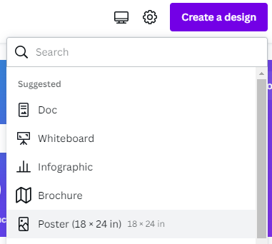
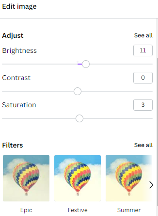
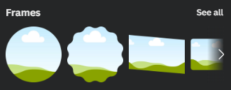
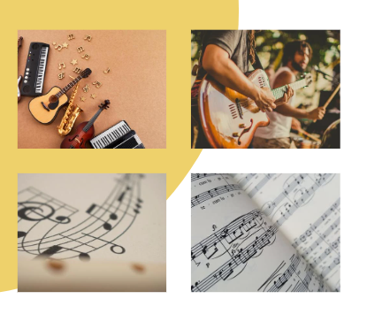

# Photo Frames & More with Canva
 
Here are some additional things you can do in Canva templates. If you have any questions, please ask! 

1. From the Canva.com home page, click on the **Create A Design** button, and then click on **Poster**. This will open up a blank poster with options for templates on the side. 

2. Search for “**Mustard and white circles music festival poster**” in the search field in the top left field above the templates, and click on the poster template shown below to load it. 

3. Click on **Elements** in the left menu, scroll to **photos** then select **see all** and choose a photo. Instead of clicking on it, **drag it over and drop it on top of the circle image** in the poster template. It will replace the image inside the circle frame and will be cropped into a circle. 
    
 
4. You might notice that this photo has a shift in colour tones. This is from the photo being adjusted with a **Filter**. To edit this, **click on the circle** image to select it, and then click on **Edit image** in the top menu bar. This will bring up a bunch of adjustment options. You can click on an option and then drag a slider. Alternatively, this could be left to defaults and the **Filters** could be used to overlay filters with preset effects.

   

    <button onclick="toggle('gif1')">Show/Hide Animation</button>
    

    
    
 

5. Change this photo frame from a circle to another shape.
  - **delete the circle image** and then click on **Elements** in the left sidebar menu. Look for **Frames** and then click on **See All**. 
  - Scroll down or type **heart** in the search bar to find the heart and click on it to add it to the poster. 
  
6. From **Elements**, go into **Photos** and drag in a new photo to the shape to add it. 
  - Once the photo is inside the shape, you can **double click** on it and the whole photo will appear, slightly greyed out and you will be able to resize and move it to fit into the shape where you want it. 
  - Once happy, click outside the template to deselect it.

7. Click on the shape again once to reselect it, and then click on the **red color swatch icon** in the top menu to change the border of the heart (white was used in this example).  

    <button onclick="toggle('gif2')">Show/Hide Animation</button>
    

    
    

8. Next, we will swap the heart for a grid. 
 - Delete the heart and click on **Elements** in the left sidebar menu. You may have to exit the last Frames search to get back into the main Elements list. Look for **Grids** and then click on **See All**.  
 - Find a grid you like and click on it to add it to your poster. It will fill up the whole poster, but for this exercise, we are going to resize it down to the size of the circle and heart images used previously. 
  - Use the handles on the sides and corners of the grid to get it down to size and drag it toward the centre until a long red bar appears to let you know that you’ve aligned it to the middle. 

9. Go back into **Photos** (or More… Pexels or Pixabay) and drag some images in to fill the grid. This is a quick way to have multiple images nicely aligned with an even gap between them. To adjust the space between the images in the grid, click on the grid to select it and then click on **Spacing** in the upper menu bar. You can also click on the individual images in the grid and apply the options in **Adjust** and **Filter** to each of them. 

10. Other things to learn within this template that are useful to know: click on the pink rectangle box at the bottom of the poster design, and then click on the checkered **Transparency** menu button in the top right menu bar. In there you can adjust how transparent your coloured boxes (and other elements with transparency options, including photos) are. 
  

      
       

11. You can also opt to bring the image to the layer above the box by selecting the image and then clicking on **Position** in the top right menu bar and clicking on **Forward**. You’ll notice in the example to the right, that the spaces between the grid are transparent so you can see the pink box between the grid now that the image is in front.

 
  <button onclick="toggle('gif3')">Show/Hide Animation</button>
  

  
  
 

  

[NEXT STEP: Academic Poster Tips](academic.html){: .btn .btn-blue } or 
[BONUS ACTIVITY: Comic Strips with Canva](comic-strip.html){: .btn .btn-blue }
