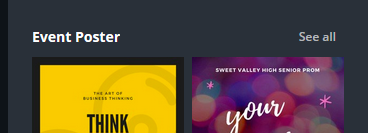
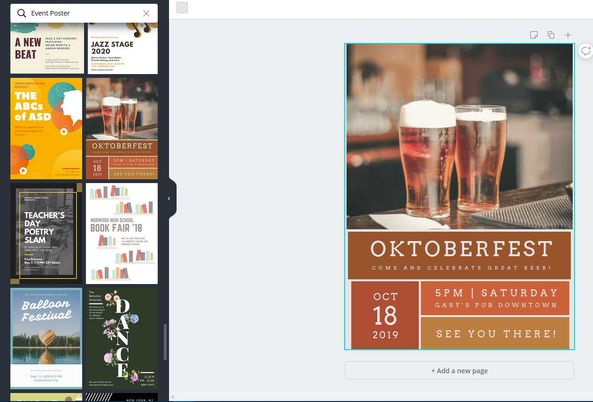
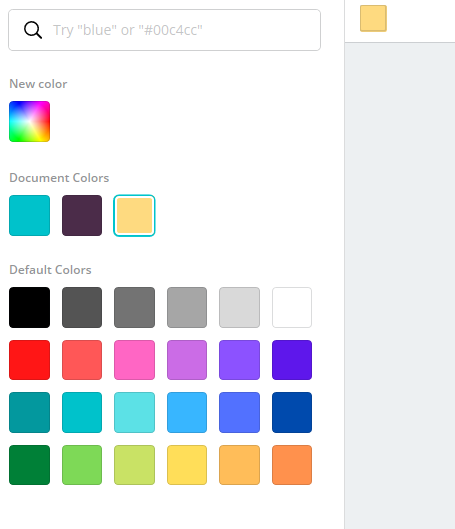
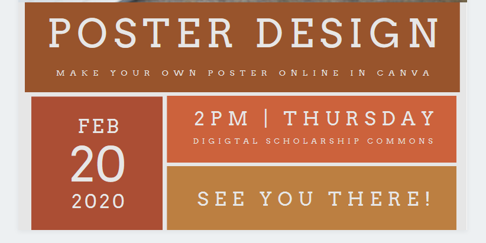

# Design a Poster with Canva 
 
Let’s start to create a poster using a Canva template. If you have any questions, please ask!

1. Create a Canva account at [canva.com](https://www.canva.com/){:target="_blank"}
 
2. Click on the teal **Create a design** button on the top right of the screen.
 
  - Type **poster** in the search box and then click on **poster** just below the search box.
  - Scroll down to the section called **Event Poster** and click on **See All** to bring up a selection of event poster ideas
  - Type in **Oktoberfest** into the search bar to bring up the thumbnail for the poster (see image to the right). Click on it to use it for this exercise.

3. To edit the template, start by clicking on the text and graphics. You can edit the text and move or delete both the text and graphics.
  - For this exercise, we are going to start by replacing the image. Click on it once to highlight it. You will see a frame appear around the border of the image. Once the image is highlighted, you can simply tap the Delete button on your keyboard or click on the Trash icon in the upper right corner of the screen to delete the image.
  - To find a new photo to replace it, mouse over to the menu on the left side of your screen and click on **More**. This will bring up some additional image search options. Click on the **Pixabay** icon to add it to your left sidebar menu. 
  - A search bar will appear at the top with “Search Pixabay for free images” in grey in it. Use this search bar to search for the word **laptop** and find an image you like. Clicking on the image of your choice in the search results will add it to your poster. Use the handles around the edge of the image to resize it to fit the space in the poster. Canva will automatically grey out any area of the image that falls outside the area of the poster so you don’t have to worry about cropping. 

4. Next, we will edit the text. Click in the text box to change the word Oktoberfest to Poster Design. The text will be just slightly too long for the text box so you will need to drag the box to make it larger, or make the font size smaller. Which would look better becomes a design choice and may require testing to decide which looks best. 
  - Once either the box or the font is resized, you will need to drag the text box back to centre. A red line will appear in the middle when you have successfully centred the box. 
  - To undo any changes and try different edits, click on the backward arrow in the top right of the screen. 
  - Edit the text in the next box below it to say “Make your own poster online in Canva” and change the font size to 24 by clicking in the upper font editing menu. Again drag the box to make sure it sits in the centre using the red line as a guide.

  - Continue with the rest of the text, making changes to font sizes as needed.
 
5. If you want to change the colours of the boxes, click on one to select it. Up in the left corner you will see a little colour swatch appear, the same colour of the box. You can click on this to bring up colour options. You can choose any of the default colours, or if you know colour names or the Hex codes for specific colours, you can search for them here. Once you’ve added the new colours, they will show up under Document Colours and so you don’t have to keep searching for them. 
 
6. Exporting & Publishing:
  - To save your poster, click on the **Download** button (arrow pointing down) on the top right of your browser, and choose a File Type. Click the teal **Download** button. Save your file in a location on your hard drive where you can find it later with a recognizable file name. Your browser may automatically save it to your Downloads folder, so if you aren’t given the option to choose a location, make sure to find it in the Downloads folder and move it somewhere of your choosing.
  - Note: PDF Print is a good choice for File Type if you want to print your poster. PNG is a good choice if you just plan to share the poster online. 
  
[NEXT STEP: Design a Brochure](canva-brochure.html){: .btn .btn-blue }
