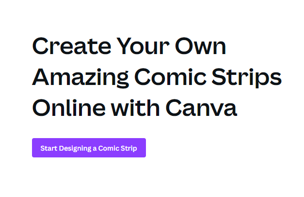
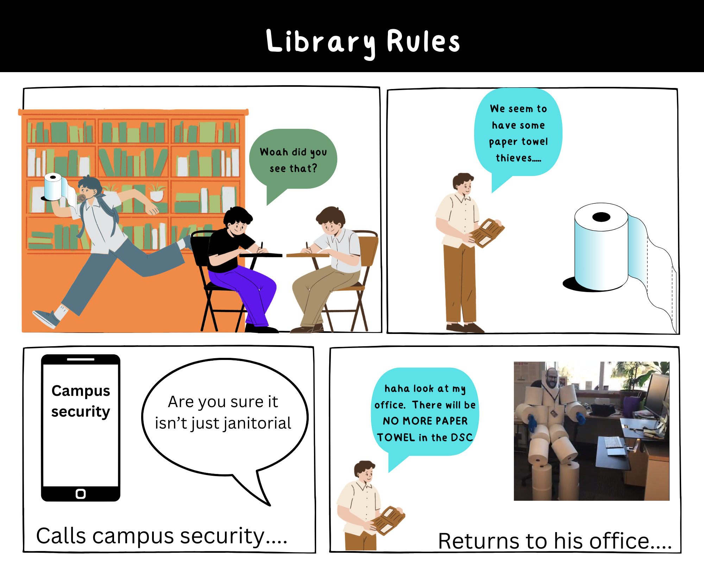

# Comic Strips with Canva 

1. Visit this [link](https://www.canva.com/create/comic-strips/){:target="_blank"} and click **Start Designing a Comic Strip**.  
2. Select a template. We suggest trying the third template titled **Blank 4 Panel Rectangles Comic Strip**.
3. Next out the options click the design you wish to use. For this workshop I will work with the **Black and White Illustrative Interactive Activity About Classroom Rules template**.
4. Give your Comic a **title** such as **Library Rules**. You can modify the size, color and writing font by selecting the text and modifying it on the top toolbar.
5. Next add graphics by selecting **elements** on the left side pannel.
6. Find graphics and select one that you like or search for a specific element using the search bar. Note some are pro options and cost so look for ones without the crown in the corner.
7. Right click on that graphic and select **view collection**.
8. Next under elements add a speech bubble by searching speech bubble in the search bar. Some speech bubbles require you to add text separately.
9. Type what the person wants to say. In this example: (Woah did you see that?)
10. Click on the person to duplicate the graphic or add another item by searching.
11. To insert a personal photo. Click on upload and drag and drop the photo of your choice.

### Example of Comic Strip in Canva
   

[NEXT STEP: Academic Poster Tips](academic.html){: .btn .btn-blue }  
