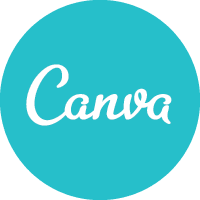

 

# Design and Layout with Canva

- Pre-workshop activities: 20 min 
- Introductory presentation: 10-15 min
- Hands-on activities: 60-90 min

## Why Canva? 

[Canva](https://www.canva.com/){:target="_blank"} is a free graphic design tool that helps users create customizable posters, brochures, cards, social media posts and more. Canva has numerous templates and features that can act as inspiration and can be changed according to your goals. This tool is web-based and works like Google Docs but for layout with design elements. It auto-saves your work so you can work across multiple computers and collaborate with teammates. Canva has a free and a premium tier. This workshop goes over how to utilize the free tools within Canva. Even in the free side of Canva, there are options to use pay-as-you-go elements (clip art and photos) but they aren’t necessary to design excellent work in this software.

## Learning objectives

Participants will be able to do the following by the end of this workshop:

1. Follow best practices guidelines for design layout
2. Use appropriately higher resolution images for print vs digital
3. Utilize various types of templates available on Canva
4. Optional: Design a poster online using Canva
5. Optional: Design a brochure online using Canva
6. Optional: Design an infographic using Canva 

[NEXT STEP: Pre-Workshop Activities](pre-workshop.html){: .btn .btn-blue }
